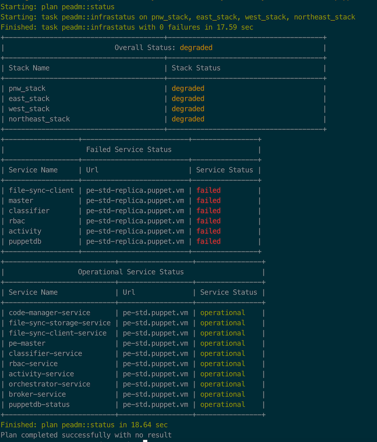

# puppet-format

[](https://travis-ci.org/voxpupuli/puppet-format)
[](https://github.com/voxpupuli/puppet-format/blob/master/LICENSE)
[](https://forge.puppetlabs.com/puppet/format)
[](https://forge.puppet.com/puppet/format)
[](https://forge.puppet.com/puppet/format)
[](https://forge.puppet.com/puppet/format)

This module includes puppet functions to transform your boring, old and worn looking ascii characters into beautiful looking masterpieces.

#### Table of Contents

1. [Description](#description)
2. [Setup - The basics of getting started with format](#setup)
    * [What format affects](#what-format-affects)
    * [Setup requirements](#setup-requirements)
    * [Beginning with format](#beginning-with-format)
3. [Usage - Configuration options and additional functionality](#usage)
4. [Limitations - OS compatibility, etc.](#limitations)
5. [Development - Guide for contributing to the module](#development)

## Description

With this module you can produce amazing looking tables, colorized strings and others transformations for output to the terminal screen.  While this module is mainly for bolt plans it could be used in puppet code anywhere.

## Setup

### What format affects

This module includes functions and datatypes only.

### Setup Requirements

Bolt and Puppet

## Usage

This module only contains functions to format and transform data.  It will not output anything to stdout and only return
formatted data ready to be sent to stdout or stderr.

### Functions

* format::colorize("string", red) # options include red, green, yellow, fatal, warning, good.
* format::table([['one', 1], ['two', 2]])

The print_table function wraps the [Terminal-Table](https://github.com/tj/terminal-table) ruby gem in a function
and tries to provide the same API.  You can create a table in two ways.
  * by passing a TableRows type  (Array of Arrays)
  * by passing a TerminalTable type (Hash of various keys)

Example:

```shell
# puppet code
format::table({title => 'GPU list', head => ['Name', 'QTY'],
               rows => [['GTX 1070', 5], ['GTX 2080 ti', 1]],
               style => {width => 60 }
            })
```

Which produces a table like:


```
+-----------------------------+----------------------------+
|                         GPU list                         |
+-----------------------------+----------------------------+
| Name                        | QTY                        |
+-----------------------------+----------------------------+
| GTX 1070                    | 5                          |
| GTX 2080 ti                 | 1                          |
+-----------------------------+----------------------------+
```

Or with colors


